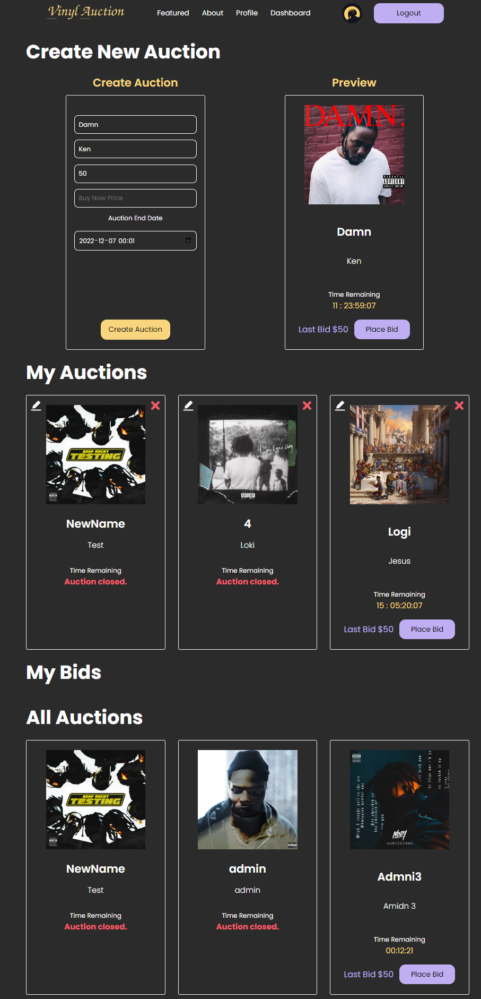
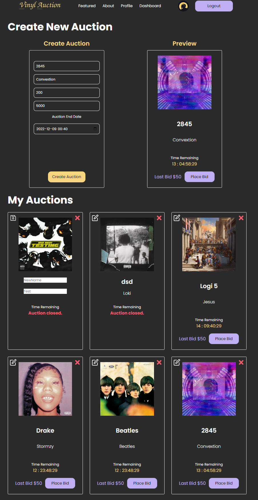
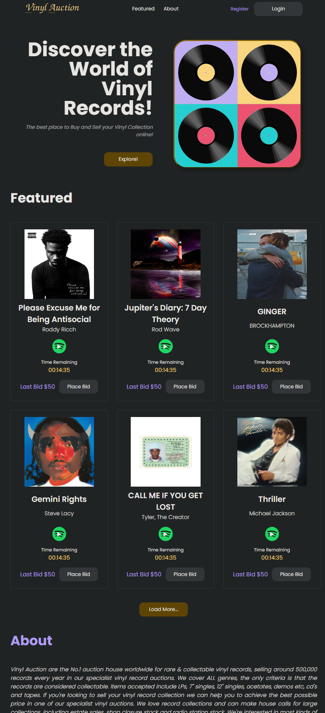
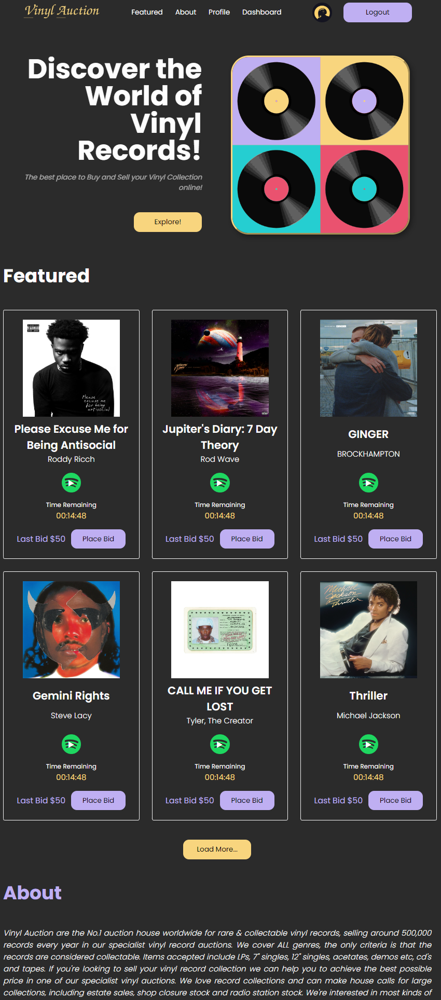
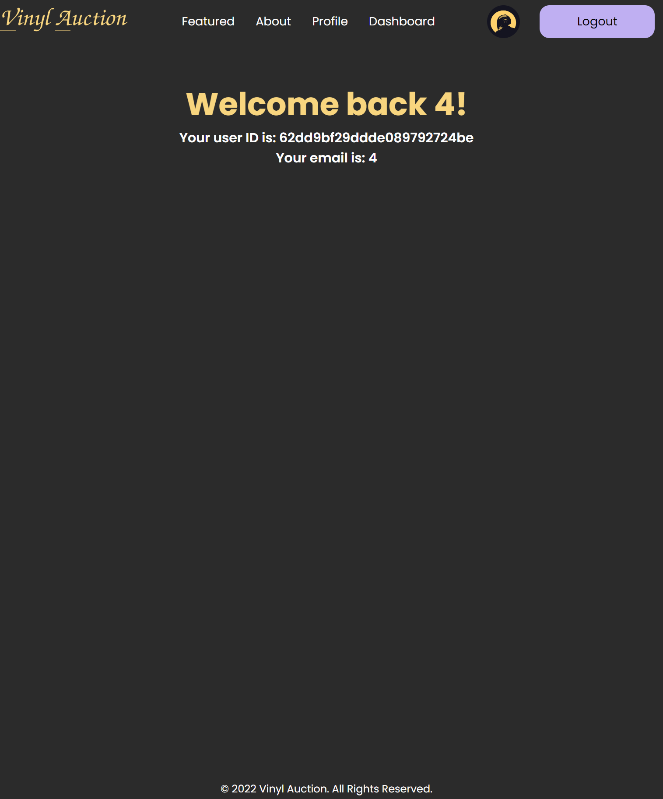

# Intro
Full-stack auction CRUD application with validation, authorization, Spotify API, connected to Mongo Database and modern application of front end technology.

App is build with create-react-app.

DEMO for Client-side: [Client Demo](https://vinyl-auction.netlify.app/)
**Server is LIMITED, if you're getting an error when trying to login the limit is reached... :( Please run locally.

# Stack
- FE:
-- Typescript
-- React
-- Redux Toolkit
-- RTK Query
-- Styled Components
- BE:
-- Node + Express + mongoose
-- MongoDB
- Toling:
-- Yup / Joi
-- ESLint + Prettier
-- Husky

## How to run locally:

npm install
npm run go (in the root)

# Look & Feel

