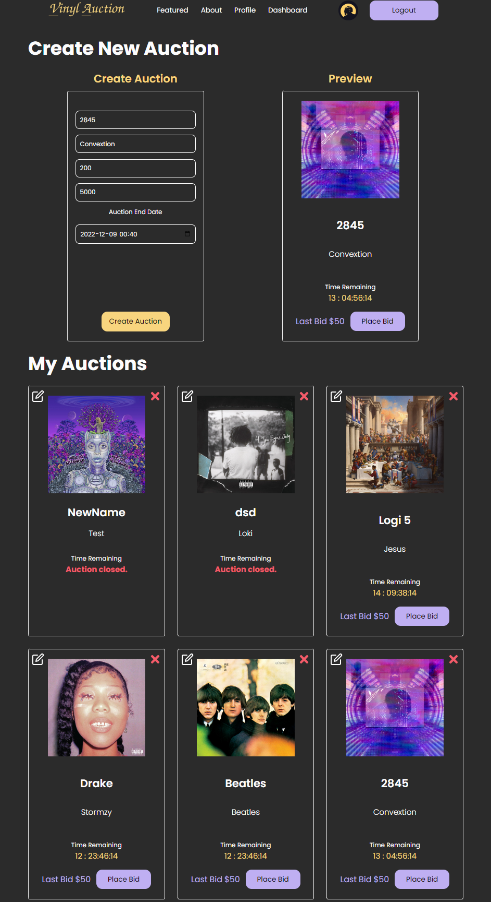

# Problems with the code
- Components are too big, hard to test - make them smaller.
- State management is not needed Redux Query and Context Api would be sufficient.
- Better use React Hook Form with Zod for form.
- Form should be moved into separate component.
- Better use Zod for both API and Frontend.
- Need E2E tests.
- Spotify calls are only mostly cached.
- Styled components sucks - more naming things, would move to Tailwind.
- Too many hooks in components, should be moved to custom hooks.
- Authentication works, but would reather use auth0 or other auth provider to have full authentication flow.
- Not fully tested.

This is an old project that I just added some tests to it, it has many problems, all of them fixeable with some time investment.
# Description

Full-stack auction CRUD application written in typescript with validation, authentication, Spotify API, connected to Mongo Database and modern application of front end technology.

App is build with create-vite-app with esbuild for compiling.

DEMO for Client-side: [Client Demo](https://vinyl-auction.netlify.app/)

Either create new Account or use username: 4 password: 4

# Code Quality

# Frontend

- Typescript
- React
- Redux Toolkit
- RTK Query
- Styled Components
- ESLint + Prettier
- Yup Validation
- Vitest for unitests

# API

- Typescript
- Node
- Express
- Mongoose
- Joi Validation

# DB

- MongoDB

# How to run locally:

npm ci && npm run go (in the root)

# Look & Feel

